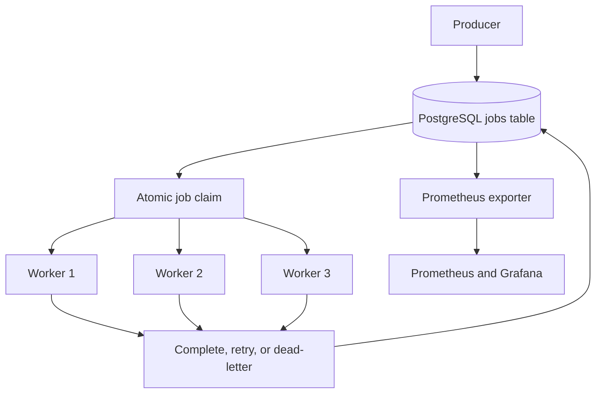

# PostgreSQL-Backed Distributed Job Queue

A distributed job-processing system that uses PostgreSQL to coordinate multiple asynchronous workers.

The project explores how background job systems handle concurrent claiming, retries, worker failures, lease renewal, dead-lettered jobs, and operational monitoring. It is intended for moderate workloads where PostgreSQL is already part of the application stack.

## Motivation

Applications often need to run work that should not block an API request, such as processing files, generating reports, or sending notifications. Existing tools such as Celery already support these workflows, but I wanted to understand the coordination mechanisms behind them.

I built this project to explore the following questions:

- How can several workers claim jobs without processing the same available row simultaneously?
- How can unfinished jobs be recovered after a worker stops?
- How should retries and permanently failed jobs be handled?
- What information is needed to monitor the health of a job queue?
- When is PostgreSQL sufficient, and when is a dedicated message broker a better choice?

## Features

- Concurrent job claiming with `SELECT FOR UPDATE SKIP LOCKED`
- Multiple asynchronous workers
- Lease-based recovery of interrupted jobs
- Periodic lease renewal for long-running jobs
- Configurable retry attempts and retry delays
- Dead-letter handling after retry exhaustion
- Priority-based job selection
- Idempotency keys for duplicate job submissions
- Worker heartbeats and job event history
- Prometheus metrics and a Grafana dashboard
- Docker Compose setup
- Failure-oriented tests for core queue behavior

## Architecture



PostgreSQL stores both the job data and its processing state. Workers use row-level locking with `SKIP LOCKED` so they can select different available jobs without waiting for rows that another worker is already claiming.

## Job Lifecycle

1. A producer inserts a pending job.
2. A worker atomically selects and claims an available job.
3. The worker records a lease expiration time before executing the handler.
4. Long-running handlers periodically renew their leases.
5. Successful jobs are marked as completed.
6. Failed jobs return to the queue after a configured delay.
7. Jobs that exhaust their allowed attempts are moved to the dead-letter state.
8. If a worker stops and its lease expires, another worker can recover the job.

## Delivery Semantics

The queue provides **at-least-once execution** with exclusive claiming of currently available jobs.

`SELECT FOR UPDATE SKIP LOCKED` prevents workers from claiming the same available row at the same time. However, a job may run more than once if a worker performs a side effect and stops before recording successful completion.

Handlers that produce external side effects should therefore be idempotent or use a separate deduplication mechanism.

Idempotency keys in this project prevent duplicate job submissions. They do not guarantee that an external side effect occurs only once.

## Technology

- Python 3.11+
- PostgreSQL 14+
- `asyncpg`
- Docker and Docker Compose
- Prometheus
- Grafana
- Rich terminal UI

## Quick Start

### Docker Compose

The Docker Compose configuration starts PostgreSQL, three workers, Prometheus, Grafana, and the metrics exporter.

```bash
docker compose up --build
```

After the services start:

| Service | Address |
| --- | --- |
| Grafana | `http://localhost:3000` |
| Prometheus | `http://localhost:9090` |
| Prometheus metrics | `http://localhost:8000/metrics` |

The included local Grafana configuration uses `admin` as both the username and password. Change these credentials before using the setup outside a local development environment.

### Local Setup

Create a PostgreSQL database and apply the schema:

```bash
createdb jobqueue2
psql -U "$USER" -d jobqueue2 -f schema.sql
```

Install the Python dependencies:

```bash
python -m pip install -r requirements.txt
```

Start the application:

```bash
python main.py
```

## Adding a Job Type

Define an asynchronous handler:

```python
async def handle_my_job(payload: dict) -> dict:
    result = do_something(payload["input"])
    return {"output": result}
```

Register the handler on each worker:

```python
worker.register_handler("my_job_type", handle_my_job)
```

Submit a job:

```python
job_id = await qm.enqueue(
    Job(
        job_type="my_job_type",
        payload={"input": "hello"},
        queue_name="default",
        priority=3,
        max_attempts=5,
        idempotency_key="unique-key-123",
    )
)
```

Handlers that communicate with external services should be safe to retry.

## Configuration

Configuration values are defined in `config.py` and can be overridden with environment variables.

| Setting | Default | Purpose |
| --- | ---: | --- |
| `poll_interval_sec` | `1.0` | Delay between polls when no job is available |
| `lease_duration_sec` | `30` | Initial period for which a worker owns a job |
| `lease_renewal_interval_sec` | `10` | Frequency of lease renewal during execution |
| `default_max_attempts` | `3` | Attempts allowed before dead-lettering |
| `default_retry_delay_sec` | `5` | Delay before retrying a failed job |
| `recovery_interval_sec` | `15` | Frequency of expired-lease recovery |
| `heartbeat_interval_sec` | `5` | Frequency of worker heartbeat updates |
| `NUM_WORKERS` | `3` | Number of workers used by the Docker setup |

The lease duration should be longer than the renewal interval. Appropriate values depend on handler duration, expected network delays, and acceptable recovery time.

## Observability

The metrics exporter provides information about:

- Pending job count
- Completed-job throughput
- Execution latency percentiles
- Failure rate
- Active workers
- Individual worker health
- Dead-letter growth

The repository includes Prometheus configuration, Grafana provisioning, and example alerting rules. The supplied thresholds are starting points for local testing and should be adjusted for a real workload.

## Testing

The failure-oriented test suite covers:

- Duplicate submissions using the same idempotency key
- Exclusive claiming with concurrent workers
- Retry exhaustion and dead-letter handling
- Priority-based job selection
- Lease behavior during longer-running jobs

Run the tests with:

```bash
python chaos_test.py
```

These tests validate the scenarios implemented in this repository. They are not a formal proof of exactly-once execution or production reliability.

## Design Tradeoffs

### Why PostgreSQL?

Using PostgreSQL avoids operating another service when an application already depends on it. It also provides durable storage, transactions, indexes, and row-level locking.

This can be a practical choice for moderate background workloads. However, queue polling and frequent state updates consume database connections and compete with normal application queries.

A dedicated message broker may be more appropriate when throughput, fan-out, retention, or independent scaling becomes a primary requirement.

### Polling

Polling keeps the worker design straightforward, but it creates a tradeoff between job pickup latency and database load.

A shorter polling interval finds jobs sooner but executes more queries while the queue is empty. A longer interval reduces database activity but increases the time before a worker detects a new job.

### Leases

Leases allow unfinished work to be recovered without keeping a database transaction open while the handler runs.

Short leases improve recovery time but increase the risk of reclaiming a job whose worker is temporarily delayed. Long leases reduce that risk but make recovery from an actual worker failure slower.

### Retries

Retries help the queue recover from temporary failures. However, retrying a non-idempotent handler can repeat an external side effect.

The queue therefore provides at-least-once execution and expects handlers with external side effects to handle possible duplicate execution.

### Priority

Workers prefer higher-priority available jobs. Strict global ordering is not guaranteed when several workers execute concurrently.

A continuous stream of high-priority work may also delay lower-priority jobs.

## Current Scope

This repository is a focused implementation rather than a general replacement for Celery, Redis Streams, Kafka, or managed queue services.

It focuses on PostgreSQL-backed job coordination and does not attempt to provide every feature of a production message broker.

Possible future improvements include:

- Automated unit and integration tests in CI
- Reproducible load tests with documented hardware and workload settings
- Fairness controls to reduce priority starvation
- PostgreSQL `LISTEN/NOTIFY` to reduce idle polling
- Retention and archival policies for completed jobs
- Graceful shutdown tests during different stages of execution
- Handler examples demonstrating idempotent external side effects

## Project Structure

```text
├── schema.sql              # Tables, indexes, and stored functions
├── config.py               # Runtime configuration
├── models.py               # Job-related data models
├── database.py             # asyncpg connection pool
├── queue_manager.py        # Database operations for the queue
├── worker.py               # Execution, renewal, heartbeat, and recovery
├── metrics.py              # Queue metric snapshots
├── dashboard.py            # Terminal dashboard
├── main.py                 # Entry point and example handlers
├── prometheus_exporter.py  # Prometheus metrics endpoint
├── chaos_test.py           # Failure-oriented test scenarios
├── abstract_backend.py     # Queue backend interface
├── scale_story.md          # Notes about scaling considerations
├── Dockerfile
├── docker-compose.yml
├── prometheus.yml
├── alerting_rules.yml
└── grafana/                # Provisioned dashboard and data source
```

## What I Learned

Building this queue helped me understand that preventing concurrent claims is different from guaranteeing exactly-once side effects.

It also helped me explore how retry behavior, lease timing, database contention, worker recovery, and observability affect a distributed job-processing system.
